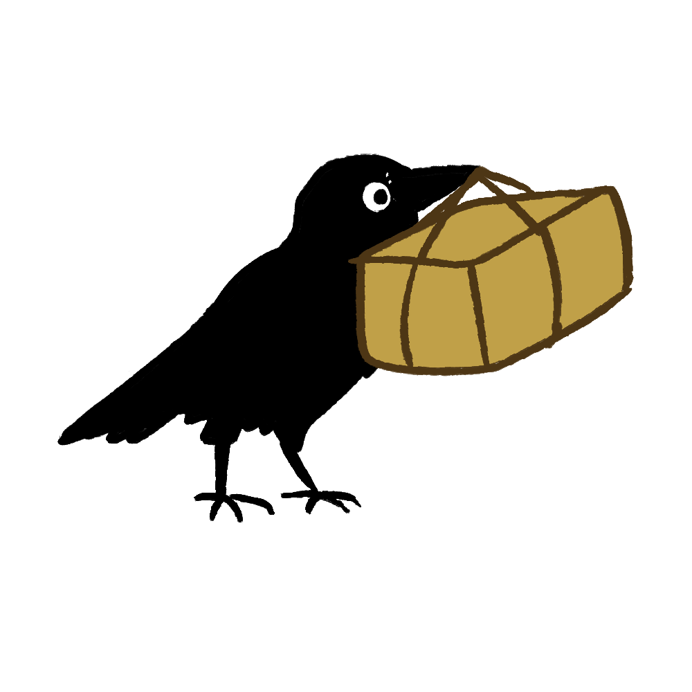

     
    <h1>Flap</h1>

Our expert team of crows has been trained to provide the best file transfer service.
Give them your packages and watch them magically flap from one device to another,
with the utmost care for your privacy and security.

---

# Just Flap It!

### END-TO-END ENCRYPTION, EVERYTIME

Our team would not learn anything should they decide to tear open your packages in transit--you can rest assured that no one but the recipient knows what's in your package, thanks to *state-of-the-art crowptography*.

### DIRECT CAWMMUNICATION

Your packages are directly transmitted to the device you intend to. *There are no middlebirds during the transit*. To ensure reliability, crows may still communicate with the rest of the flock to determine the recipient's final location. This does not affect your privacy, and will become optional in the future.
                
### CROWCURRENT

You may transfer *more than one file at a time*. Just throw them to the crows, and they'll take care of the rest.

# Frequently Asked Questions

### "HOW DO I USE THIS APP?"

It starts with a single-use <i>ticket</i>. You need to give this ticket to the intended recipient. This ticket contains all the information needed to initiate a transfer. It also contains secret keys used to encrypt your files, so make sure to keep it between you and the recipient. The crows have no knowledge of the ticket's secrets, which ensures your privacy and security.

### "IS THERE A WEB VERSION?"

No. And we likely won't make one.

This is for two reasons: the first is that Flap is designed to be trustless. With a web version, you would have to trust that the website did not decide to give you malicious code. This undermines the security for everyone, even those using the app. With apps, trust is increased because you can compile it yourself and have more control over what the app can do and with whom it can communicate.

The second reason is that web browsers are not uniformly configured. They are different for everyone. Privacy settings within browsers or user extensions will usually mess with features that Flap would require (for good reasons!), and thus would break our service. Using an app prevents this problem and makes the service more reliable.

### "HOW DOES THE CAWMMUNATION WORK?"

We use <a href="https://iroh.computer">iroh</a>, creating a peer-to-peer connection between your device and the recipient's device. In more technical terms, it is a library combining QUIC with NAT punching and relays. QUIC is a modern way of connecting between devices, and allows us to make things fast, easy, and secure. NAT punching allows devices to connect to each other without being bothered by things like firewalls. Relays are optional servers that help the recipient find the information required to initiate a connection with the sender. Relays don't contain information about the files or the transfers.

### "HOW ARE MY FILES ENCRPYTED?"

Files are encrypted using secret keys generated from the ticket. Thanks to the design of tickets, no one but you and the recipient knows how to decrypt the file. The encryption used is <code>XChaCha20-Poly1305</code>, which is fast, modern, well-known, and verifies the integrity of the file as it gets transferred.